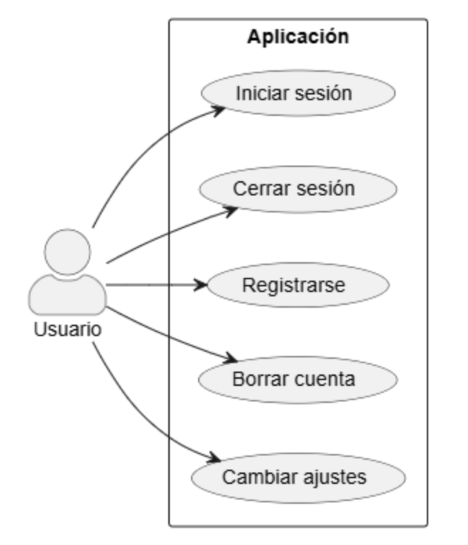
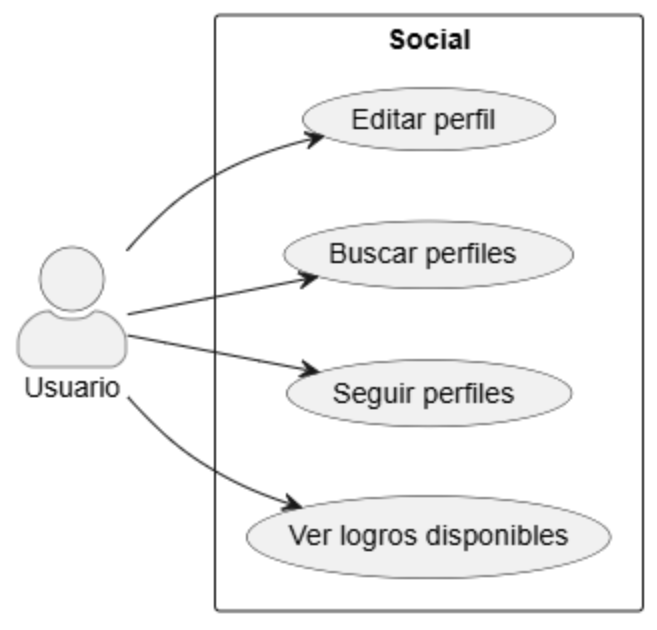
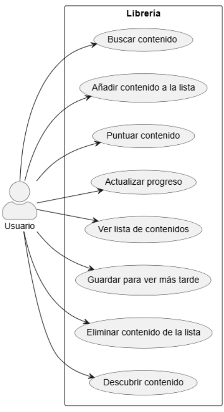
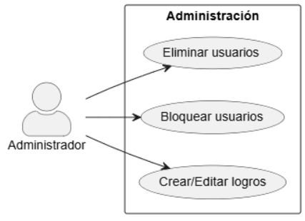

# Diagrama de casos de uso

**Casos de uso entre el Usuario y la Aplicación** 

 

**Casos de uso del Usuario relacionados con acciones Sociales** 

 

**Casos de uso entre el Usuario y la Librería** 

 

**Casos de uso entre el Usuario y la Aplicación** 

