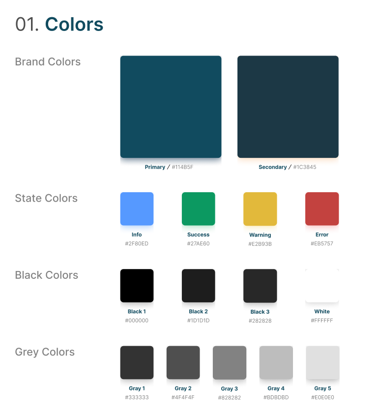
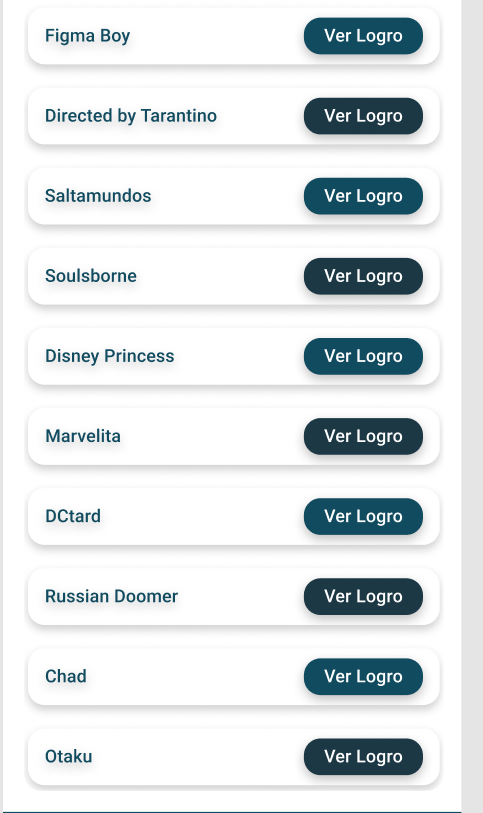
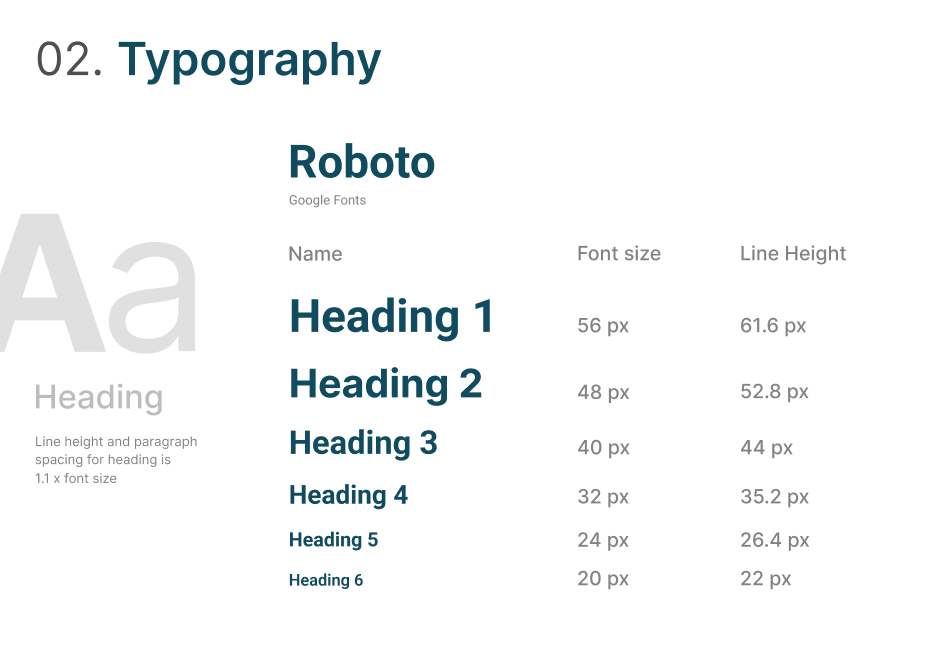
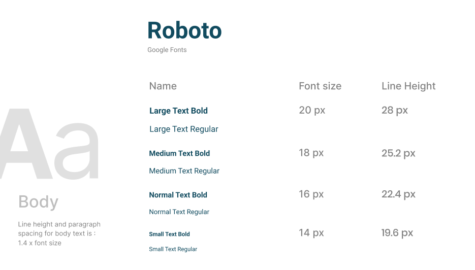
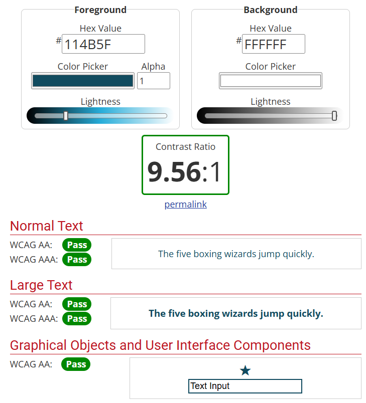
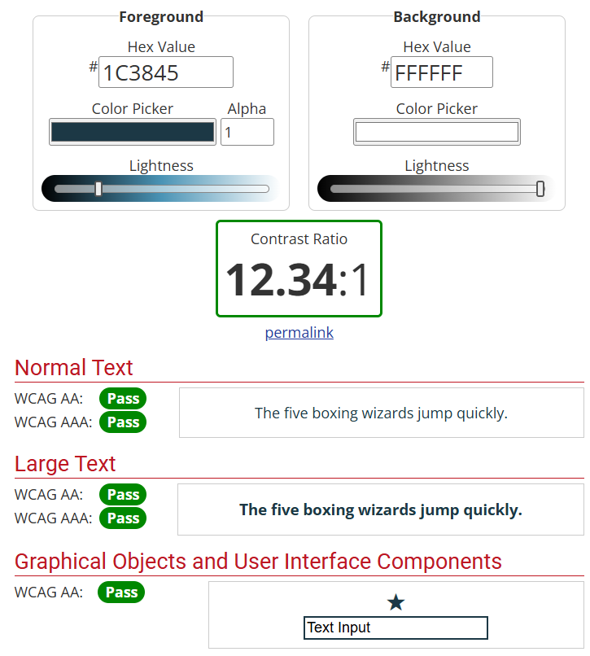
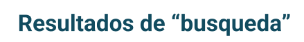
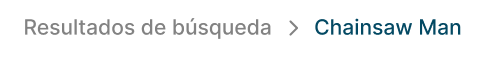
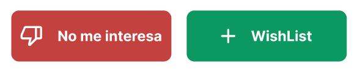
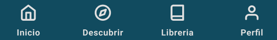

# Design System y Justificación del diesño

El Design System (Sistema de diseño) consiste en los valores establecidos que se utilizarán a lo largo de la página web y la aplicación movil de MediaLibrary. De este modo se consigue que todo sea uniforme y además agiliza el proceso de diseño.

---

## Carta de Colores

La paleta de colores de nuestra aplicación y página web es la siguiente: 

Se ha escogido como color principal un azúl oscuro ya que transmite tranquilidad y profesionalidad, encajando perfectamente con el diseño minimalista que se pretende conseguir. Además, el azúl oscuro combina con la mayoría de los colores, permitiendo que las portadas de los libros, videojuegos y películas no desentonen.

Como color secundario se ha optado por un tono más oscuro de azul que sea similar al principal. Este color se utilizará para el modo oscuro de nuestras aplicaciones y también para dar una sensación de separación cuando hayan muchos botones aglomerados, asegurando la estética visual y comodidad de uso. He aquí un ejemplo:

Para los colores de estado se han seleccionado aquellos más intuitivos y estandarizados para transmitir la información, de este modo, evitamos que los usuarios tengan que aprender qué significa cada color.

--- 

## Tipografía 

Las tipografías que hemos establecido son las siguientes:

Hemos decidido utilizar Roboto como nuestra fuente principal ya que es ampliamente soportada en los sistemas, no tiene serifa y por tanto facilita la lectura para las personas.

El tamaño de la tipografía más pequeño utilizado es de 16 píxeles para la página (texto normal) y de 14 píxeles (texto pequeño) para pantallas móviles. Esto asegura que sea lo suficientemente grande para ser legible por los usuarios.

---

## Iconografía

En cuanto a los iconos de la aplicación hemos decidido utilizar los diseños de Material Symbols que ofrece Google de manera gratuita y con licencia Apache 2.0.

Las imágenes de los libros, videojuegos y películas serán utilizadas bajo las licencias que establezcan las APIs.

Por otra parte, las imágenes o videos que no provengan de las APIs serán descargados desde Pixabay o Pexels, que son páginas web que ofrecen contenido multimedia con licencias poco restrictivas.

Pexels:
https://www.pexels.com/es-es/

Pixabay:
https://pixabay.com/

Google Fonts:
https://fonts.google.com/icons

--- 

## Accesibilidad

Hemos comprobado mediante la siguiente página web que los colores utilizados en la página web tienen un buen contraste y por ende son accesibles para aquellas personas con problemas de visión como el daltonismo.

WebAIM: Contrast Checker:
https://webaim.org/resources/contrastchecker/

Además, como se mencionó anteriormente, se ha establecido un tamaño de letra lo suficientemente grande para que sea accesible.

--- 

## Usabilidad

Para comprobar la usabilidad de la página web y aplicación móvil se ha creado un prototipo que han utilizado compañeros de clase para comprobar que la interfaz es intuitiva, sencilla, cómoda.

También se ha utilizado una estrategia de diseño centrada en el usuario y con metodología “Mobile First”.

Además se han cumplido los distintos principios heurísticos de Nielsen sobre usabilidad. Estos son algunos ejemplos:

- Visibilidad del estado del sistema: Informamos al usuario de donde se encuentra mediante distintas técnicas, como títulos o trazas de navegación:

- Diseño estético y minimalista

- Correspondencia entre el sistema y el mundo real: Los iconos son lógicos y se relacionan claramente con su función:

